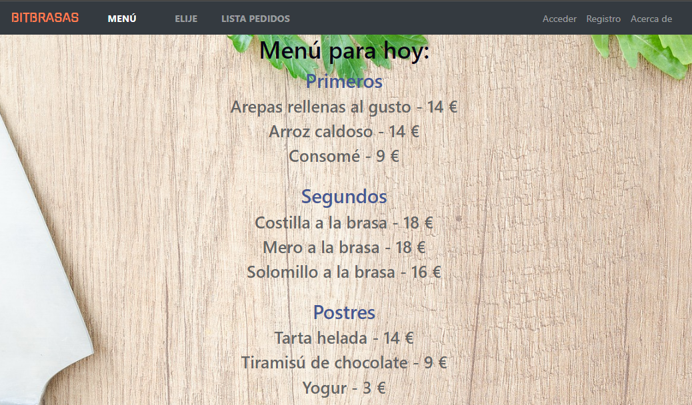
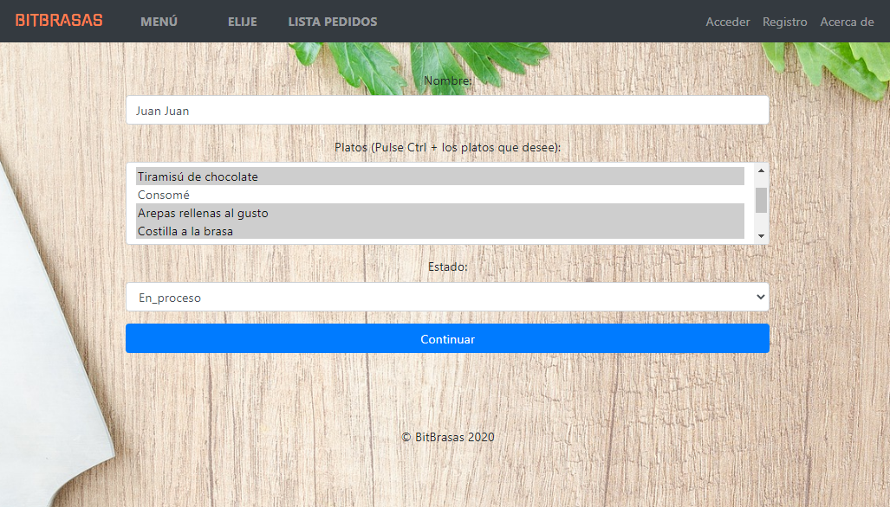
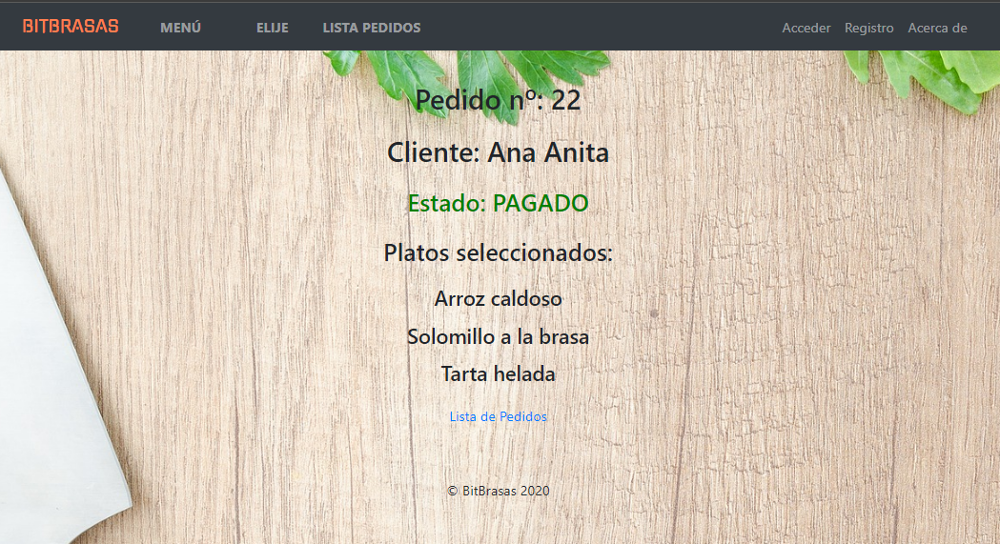
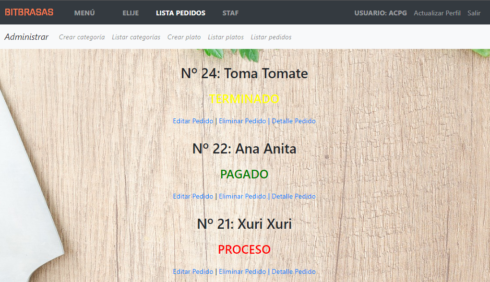

# WebRestaurante

Proyecto apllicación web que simulará la gestión de la web de un restaurante.

Este proyecto corresponde a un conjunto de tres exámenes del curso **Python Web Programmer** realizado en **Intecssa**.

Se utilizará el *framework* **Django** y la base de datos **PostgreSQL**.

## Capturas
Menú

Selección de platos por parte de un cliente

Detalle de  un pedido

Listado de pedidos (usuario registrado)
